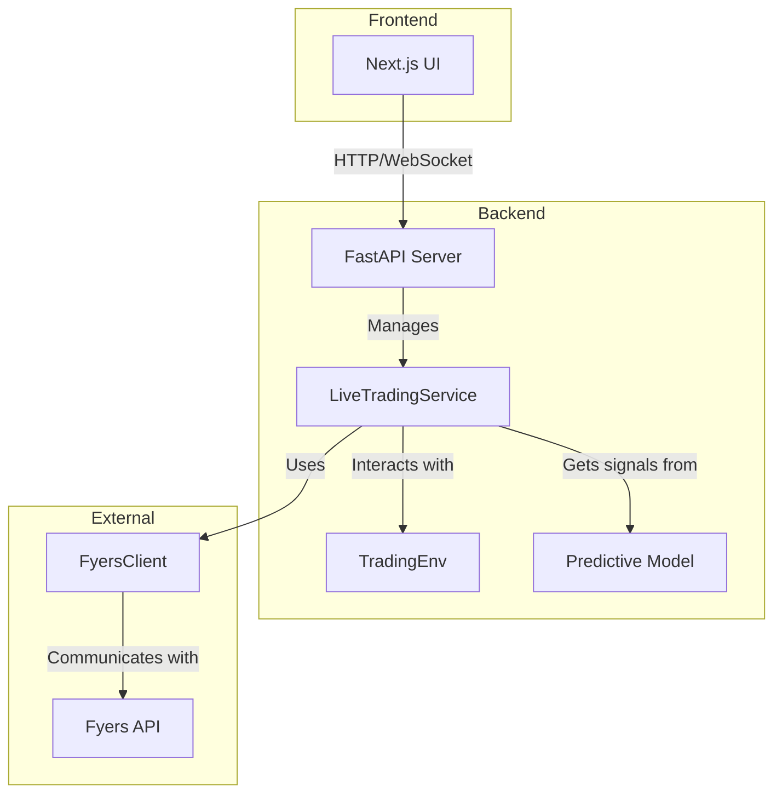
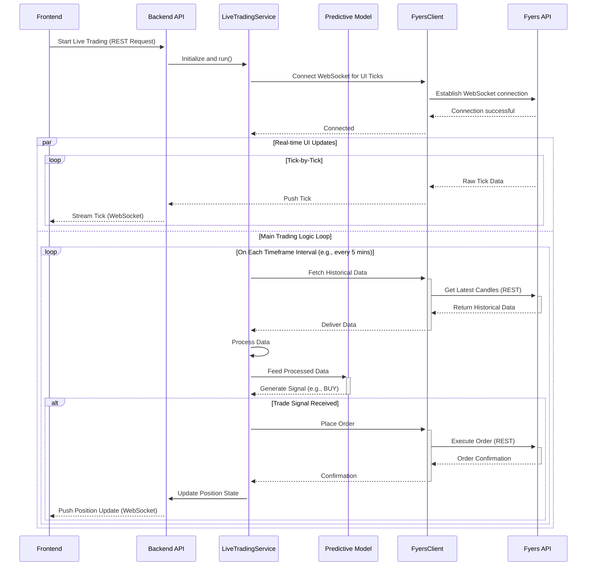

# Live Trading System Architecture Document

## 1. Introduction

This document outlines the overall project architecture for the Live Trading System, including backend systems, shared services, and non-UI specific concerns. Its primary goal is to serve as the guiding architectural blueprint for AI-driven development, ensuring consistency and adherence to chosen patterns and technologies.

**Relationship to Frontend Architecture:**

The project includes a significant user interface, and a separate Frontend Architecture Document should be created to detail the frontend-specific design. The core technology stack choices documented herein are definitive for the entire project, including the frontend components.

**Starter Template or Existing Project**

The project is based on an existing codebase. The backend is built with Python and FastAPI, and the frontend is a Next.js application. The architecture will be designed to enhance and build upon this existing foundation.

**Change Log**

| Date | Version | Description | Author |
| :--- | :--- | :--- | :--- |
| 2025-08-06 | 1.0 | Initial draft | Winston, Architect |

## 2. High Level Architecture

### Technical Summary

The system is designed as a locally-hosted, real-time trading application with a decoupled frontend and backend. The architecture prioritizes a clear separation of concerns, with dedicated services for data processing, trading logic, and API interactions. The backend is built with Python and FastAPI, leveraging the existing codebase, while the frontend is a Next.js application. The core architectural pattern is a service-oriented approach, with real-time communication handled by WebSockets. This architecture directly supports the PRD's goals of providing a flexible, reliable, and user-friendly trading experience.

### High Level Overview

*   **Architectural Style:** The system follows a **Service-Oriented Architecture (SOA)**, with distinct services for different business capabilities (e.g., data fetching, trading, user authentication).
*   **Repository Structure:** A **Monorepo** structure is used to manage the frontend and backend code in a single repository, simplifying dependency management and ensuring consistency.
*   **Service Architecture:** The backend is a **local server** running a FastAPI application. It is not a distributed system.
*   **User Interaction Flow:**
    1.  The user interacts with the Next.js frontend.
    2.  The frontend communicates with the FastAPI backend via a REST API for configuration and historical data, and a WebSocket for real-time data.
    3.  The backend fetches data from the Fyers API, processes it, and feeds it to the predictive model.
    4.  The model generates trading signals, which are then executed by the trading service.
    5.  The results are sent back to the frontend in real-time.

### High Level Project Diagram

```mermaid
graph TD
    subgraph User Interface
        A[Next.js Frontend]
    end

    subgraph Backend Services (Local Server)
        B[FastAPI Backend]
        C[LiveTradingService]
        D[FyersClient]
        E[Predictive Model]
        F[TradingEnv]
    end

    subgraph External Services
        G[Fyers API]
    end

    A -- REST API & WebSocket --> B
    B -- Manages --> C
    C -- Uses --> D
    C -- Uses --> E
    C -- Uses --> F
    D -- Fetches data from --> G
```

### Architectural and Design Patterns

*   **Service-Oriented Architecture (SOA):** The backend is structured as a collection of services, each with a specific responsibility. This promotes modularity and makes the system easier to maintain and extend.
*   **Repository Pattern:** The `FyersClient` acts as a repository, abstracting the data access logic for the Fyers API. This isolates the rest of the application from the specifics of the API.
*   **Dependency Injection:** FastAPI's dependency injection system will be used to manage the dependencies between the different services. This improves testability and reduces coupling.
*   **Real-time Communication (WebSockets):** WebSockets are used for bidirectional, real-time communication between the frontend and backend, which is essential for a trading application.

## 3. Tech Stack

This table represents the single source of truth for the technologies used in this project. All development must adhere to these choices.

### Cloud Infrastructure

-   **Provider:** N/A (Local Deployment)
-   **Key Services:** N/A
-   **Deployment Regions:** N/A

### Technology Stack Table

| Category | Technology | Version | Purpose | Rationale |
| :--- | :--- | :--- | :--- | :--- |
| **Language (Backend)** | Python | 3.11+ | Core backend logic, data processing, and model inference | Existing codebase is in Python; strong ecosystem for data science. |
| **Framework (Backend)**| FastAPI | 0.100+ | Building the backend REST API and WebSocket services | High performance, easy to use, and already implemented in `backend/main.py`. |
| **Language (Frontend)**| TypeScript | ~5.0 | Primary language for the frontend application | Provides static typing for better code quality and maintainability. |
| **Framework (Frontend)**| Next.js | ~15.4 | React framework for the user interface | Provides a robust foundation for server-rendered React applications. |
| **UI Components** | Radix UI | ~1.1 | Core UI component library | Provides accessible, unstyled components for building a custom design system. |
| **Styling** | Tailwind CSS | ~4.0 | CSS framework for styling the user interface | Utility-first approach allows for rapid and consistent styling. |
| **Charting** | Lightweight Charts| ~5.0 | Displaying financial charts | High-performance charting library from TradingView, ideal for this project. |
| **Real-time Comms** | WebSockets | N/A | Real-time data streaming between backend and frontend | Essential for live trading data; already part of the FastAPI setup. |
| **Database/Storage** | JSON File | N/A | Storing trade logs and metrics | Meets the requirement for simple, local storage of trade data. |
| **Testing (Backend)** | Pytest | 7.0+ | Testing the Python backend code | A mature and feature-rich testing framework for Python. |
| **Testing (Frontend)** | Jest & RTL | Latest | Testing the React components and frontend logic | Standard testing stack for React/Next.js applications. |

## 4. Data Models

### Trade

**Purpose:** To provide a comprehensive, persistent record of every trade executed by the system, whether automated or manual. This model is the source of truth for all historical performance analysis and will be stored in the `tradelog.json` file.

**Key Attributes:**
-   `tradeId`: `string` - A unique identifier for the trade.
-   `instrument`: `string` - The trading symbol (e.g., "NSE:NIFTY50-INDEX").
-   `timeframe`: `string` - The timeframe used for the trade (e.g., "5m").
-   `tradeType`: `string` - The type of trade ('Automated' or 'Manual').
-   `direction`: `string` - The direction of the trade ('Long' or 'Short').
-   `entryTime`: `datetime` - The timestamp of the trade entry.
-   `entryPrice`: `float` - The price at which the trade was entered.
-   `exitTime`: `datetime` - The timestamp of the trade exit.
-   `exitPrice`: `float` - The price at which the trade was exited.
-   `stopLoss`: `float` - The stop-loss price for the trade.
-   `targetPrice`: `float` - The target price for the trade.
-   `quantity`: `int` - The quantity of the instrument traded.
-   `pnl`: `float` - The final profit or loss from the trade.
-   `holdingTimeSeconds`: `int` - The duration of the trade in seconds.
-   `status`: `string` - The outcome of the trade ('Win', 'Loss', 'Breakeven').

**Relationships:**
-   Each `Trade` is associated with a single `User`.

---

### Position

**Purpose:** To represent the real-time state of an active, open trade within the `LiveTradingService`. This is a transient model that exists only while a trade is live.

**Key Attributes:**
-   `instrument`: `string` - The trading symbol.
-   `direction`: `string` - The direction of the trade.
-   `entryPrice`: `float` - The entry price.
-   `quantity`: `int` - The quantity.
-   `stopLoss`: `float` - The current stop-loss price.
-   `targetPrice`: `float` - The current target price.
-   `currentPnl`: `float` - The real-time, unrealized profit or loss.
-   `tradeType`: `string` - The type of trade ('Automated' or 'Manual').

**Relationships:**
-   A `Position` is a live instance that will eventually be converted into a `Trade` record upon closing.

---

### User

**Purpose:** To hold the authenticated user's profile information, primarily fetched from the Fyers API.

**Key Attributes:**
-   `userId`: `string` - The user's unique identifier (e.g., Fyers ID).
-   `name`: `string` - The user's name.
-   `capital`: `float` - The user's available trading capital.
-   `accessToken`: `string` - The session's Fyers API access token.

**Relationships:**
-   A `User` can have many `Trade` records.

## 5. Components

### Frontend Application
-   **Responsibility:** To provide the user interface for the trading system. This includes displaying real-time data, visualizing trades, and allowing for manual trade entry.
-   **Key Interfaces:**
    -   Communicates with the Backend API via REST for configuration and historical data.
    -   Communicates with the Backend API via WebSockets for real-time data and trade updates.
-   **Dependencies:** Backend API
-   **Technology Stack:** Next.js, React, TypeScript, Tailwind CSS, Lightweight Charts

### Backend API
-   **Responsibility:** To serve the frontend application and act as the central hub for all backend services. It handles user authentication, API requests, and WebSocket connections.
-   **Key Interfaces:**
    -   Exposes a REST API for the frontend.
    -   Provides a WebSocket endpoint for real-time communication.
-   **Dependencies:** LiveTradingService, FyersClient
-   **Technology Stack:** Python, FastAPI

### LiveTradingService
-   **Responsibility:** To manage the core trading logic on a **scheduled, time-based interval**. This includes **triggering a new fetch of historical data** at the start of each candle, feeding it to the predictive model, managing positions, and executing trades. It also relays raw tick data from the `FyersClient` to the `Backend API` for frontend streaming.
-   **Key Interfaces:**
    -   Is managed by the Backend API.
    -   Uses the FyersClient to interact with the Fyers API.
    -   Uses the Predictive Model to generate trading signals.
-   **Dependencies:** FyersClient, Predictive Model, TradingEnv
-   **Technology Stack:** Python

### FyersClient
-   **Responsibility:** To encapsulate all interactions with the Fyers API. This includes fetching historical data **on a recurring basis**, managing a WebSocket connection to stream **raw tick data**, and placing orders.
-   **Key Interfaces:**
    -   Provides methods for the LiveTradingService to use.
-   **Dependencies:** Fyers API (external)
-   **Technology Stack:** Python

### Predictive Model
-   **Responsibility:** To generate trading signals (buy, sell, hold, etc.) and quantities based on the processed real-time data.
-   **Key Interfaces:**
    -   Is loaded and used by the LiveTradingService.
-   **Dependencies:** None (it is a self-contained model file)
-   **Technology Stack:** PyTorch (`.pth` file)

### TradingEnv
-   **Responsibility:** To manage the state of the trading environment, including the current position, account balance, and the calculation of SL/TP levels.
-   **Key Interfaces:**
    -   Is used by the LiveTradingService to manage the state of trades.
-   **Dependencies:** None
-   **Technology Stack:** Python

### Component Diagram



## 6. External APIs

### Fyers API V3
-   **Purpose:** To provide all necessary market data and trading functionality, including historical data, real-time data via WebSocket, order placement, and account information.
-   **Documentation:** The primary source of truth for all Fyers API details is the local file: `fyers_docs.txt`. All development should refer to this file.
-   **Base URL(s):** `https://api-t1.fyers.in/api/v3`
-   **Authentication:** OAuth 2.0 with an `app_id` and `access_token`. The `FyersClient` and `fyers_auth_service` handle the authentication flow as detailed in `fyers_docs.txt`.
-   **Rate Limits:** The Fyers API has rate limits that need to be respected. The specific limits are detailed in `fyers_docs.txt`. The `FyersClient` should be designed to handle these limits gracefully.
-   **Key Endpoints Used:**
    -   `/data-rest/v3/history`: To fetch historical candlestick data.
    -   `/data-rest/v3/quotes`: To get real-time quotes.
    -   `/trade-rest/v3/orders`: To place and manage orders.
    -   `/trade-rest/v3/positions`: To get open positions.
    -   `/trade-rest/v3/funds`: To get account funds and margin information.
    -   **WebSocket:** For real-time market data.
-   **Integration Notes:** The existing `FyersClient` in `src/trading/fyers_client.py` already encapsulates some of this functionality. It will be the single point of contact for all interactions with the Fyers API.

## 7. Core Workflows

This diagram illustrates the updated sequence of events, showing the time-based backend loop and the separate, parallel flow of tick data to the frontend.



## 8. REST API Spec

```yaml
openapi: 3.0.0
info:
  title: Live Trading System API
  version: 1.0.0
  description: API for the Live Trading System, providing access to configuration, data, and trading functionality.
servers:
  - url: http://localhost:8000
    description: Local development server

paths:
  /api/health:
    get:
      summary: Health Check
      responses:
        '200':
          description: API is healthy
  /api/login:
    post:
      summary: User Login
      requestBody:
        required: true
        content:
          application/json:
            schema:
              $ref: '#/components/schemas/LoginRequest'
      responses:
        '200':
          description: Login successful
  /api/profile:
    get:
      summary: Get User Profile
      responses:
        '200':
          description: User profile data
          content:
            application/json:
              schema:
                $ref: '#/components/schemas/User'
  /api/config:
    get:
      summary: Get System Configuration
      responses:
        '200':
          description: List of available instruments and timeframes
  /api/historical-data:
    get:
      summary: Get Historical Data
      parameters:
        - name: instrument
          in: query
          required: true
          schema:
            type: string
        - name: timeframe
          in: query
          required: true
          schema:
            type: string
      responses:
        '200':
          description: Historical candlestick data
  /api/live/start:
    post:
      summary: Start Live Trading
      responses:
        '200':
          description: Live trading started
  /api/live/stop:
    post:
      summary: Stop Live Trading
      responses:
        '200':
          description: Live trading stopped
  /api/manual-trade:
    post:
      summary: Place a Manual Trade
      requestBody:
        required: true
        content:
          application/json:
            schema:
              $ref: '#/components/schemas/ManualTradeRequest'
      responses:
        '200':
          description: Manual trade placed

components:
  schemas:
    LoginRequest:
      type: object
      properties:
        app_id:
          type: string
        secret_key:
          type: string
        redirect_uri:
          type: string
        fy_id:
          type: string
        pin:
          type: string
        totp_secret:
          type: string
    User:
      type: object
      properties:
        userId:
          type: string
        name:
          type: string
        capital:
          type: number
    ManualTradeRequest:
      type: object
      properties:
        instrument:
          type: string
        direction:
          type: string
        quantity:
          type: integer
        stopLoss:
          type: number
        targetPrice:
          type: number
```

## 9. Database Schema

The database for this project is a simple JSON file named `tradelog.json`. This file will contain an array of trade objects, where each object has the following structure:

```json
[
  {
    "tradeId": "string",
    "instrument": "string",
    "timeframe": "string",
    "tradeType": "string",
    "direction": "string",
    "entryTime": "string (ISO 8601)",
    "entryPrice": "number",
    "exitTime": "string (ISO 8601)",
    "exitPrice": "number",
    "stopLoss": "number",
    "targetPrice": "number",
    "quantity": "integer",
    "pnl": "number",
    "holdingTimeSeconds": "integer",
    "status": "string"
  }
]
```

## 10. Next Steps

This architecture document provides a comprehensive blueprint for the development of the Live Trading System. The next steps are as follows:

1.  **Frontend Architecture:**
    *   A dedicated **Frontend Architecture** should be created to detail the specifics of the Next.js application, including state management, component hierarchy, and data flow within the frontend. The `ux-expert` agent can lead this effort, using this document and the `ux-vision.md` as a foundation.

2.  **Development Kick-off:**
    *   The `dev` agent can now begin implementation, following the epics and stories outlined in the PRD (`docs/prd.md`) and adhering to the architecture defined in this document.
    *   The initial focus should be on **Epic 1: API and Frontend Integration**, as this will establish the core communication channels between the frontend and backend.

3.  **Handoff Prompts:**

    *   **To the `dev` agent:**
        > "Hello James,
        > We are ready to begin development of the Live Trading System. The full requirements are in `docs/prd.md`, and the system architecture is detailed in `docs/architecture.md`.
        >
        > Please start with **Epic 1** and focus on enhancing the existing `FastAPI` backend and integrating it with the `Next.js` frontend. Your first priority is to ensure that real-time tick data and historical data can be reliably passed from the backend to the frontend for visualization.
        >
        > Let us know if you have any questions."

    *   **To the `ux-expert` for Frontend Architecture:**
        > "Hello Sally,
        > Based on the main architecture document (`docs/architecture.md`) and the UI/UX vision (`docs/ux-vision.md`), please create a detailed **Frontend Architecture Document**.
        >
        > This should cover state management strategy (e.g., React Context, Zustand), a detailed component breakdown, and the data flow within the Next.js application.
        >
        > Thank you."
