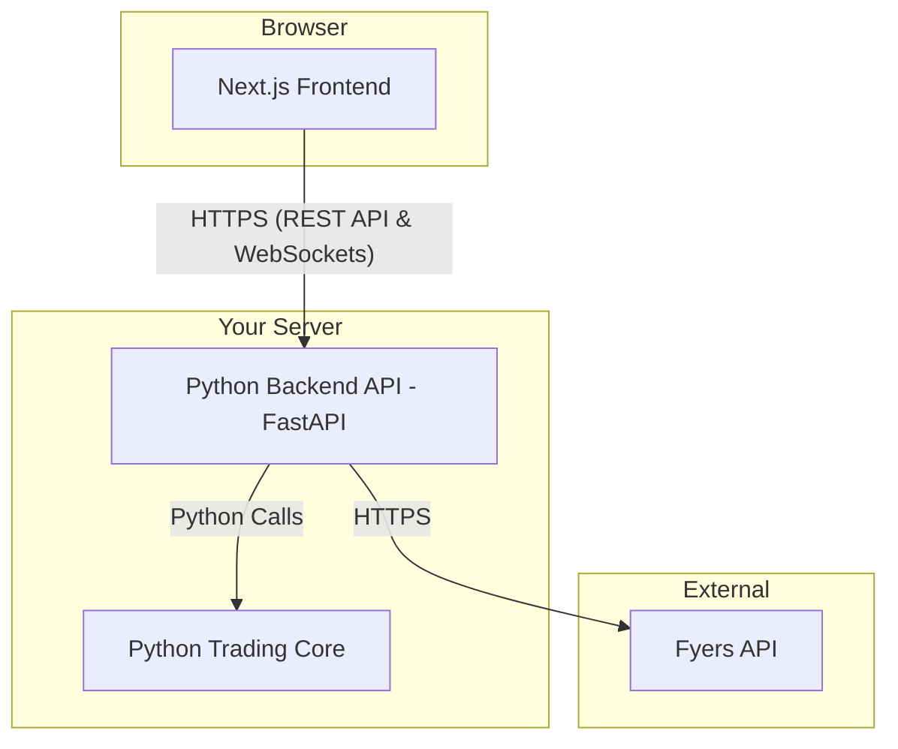
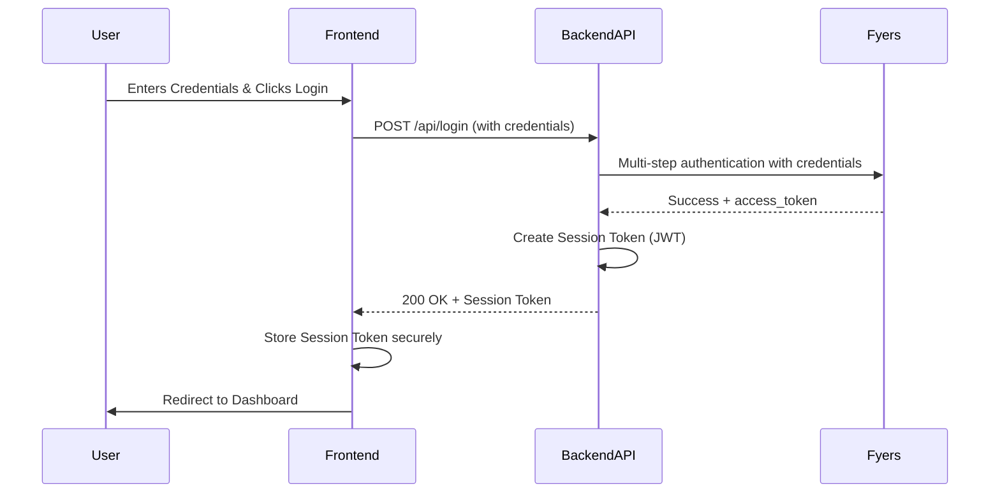
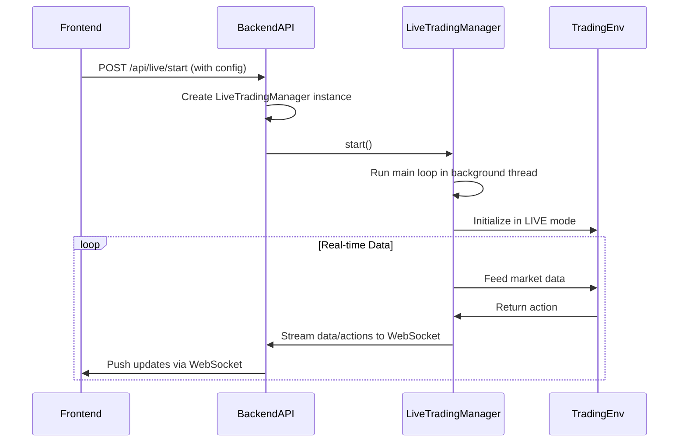

# Architecture Design Document: AlgoTrading System

**Version:** 1.0
**Date:** 2025-07-31
**Author:** Winston, Architect

## 1. Overview

This document outlines the technical architecture for the AlgoTrading web interface. It complements the Product Requirements Document (PRD) by detailing the "how" of the system, focusing on component integration, refactoring of existing code, and data flow.

The system is composed of four primary components:
1.  **Next.js Frontend:** A modern, responsive web application for all user interaction.
2.  **Python Backend (API):** A FastAPI application that acts as a secure controller and orchestrator.
3.  **Python Trading Core (Existing):** The battle-tested `TradingEnv` and its related managers.
4.  **Fyers API:** The external brokerage service.

### 1.1. High-Level System Diagram



## 2. Component Breakdown & Integration Plan

### 2.1. Monorepo Structure

The project will be organized as a monorepo to simplify development and dependency management.

```
/AlgoTrading
|-- /frontend/         # The new Next.js application
|-- /src/              # Existing Python trading core
|-- /backend/          # The new Python backend API (FastAPI)
|-- /docs/
|-- ...etc
```

### 2.2. Frontend (Next.js)

*   **Location:** `/frontend`
*   **Framework:** Next.js with App Router.
*   **Responsibilities:**
    *   Render all UI components.
    *   Manage client-side state (e.g., UI state, form inputs).
    *   Handle user input.
    *   Communicate with the Python Backend API via HTTPS.
    *   **CRITICAL:** The frontend will **NEVER** store or handle Fyers API credentials. It will only manage the session token (e.g., JWT) provided by the backend after login.

### 2.3. Backend (Python FastAPI)

*   **Location:** `/backend` (New Directory)
*   **Framework:** FastAPI
*   **Responsibilities:**
    *   Act as the **secure gateway** to the trading system.
    *   Expose a RESTful API for the frontend (e.g., `/login`, `/profile`, `/backtest/start`).
    *   Expose WebSocket endpoints for real-time communication (`/ws/backtest/{id}`, `/ws/live`).
    *   Orchestrate the existing Python Trading Core components.
    *   Manage the lifecycle of trading sessions.

### 2.4. Existing Python Code (`/src`)

#### 2.4.1. `src/auth/fyers_auth.py` (Refactor)

*   **Action:** This script will be converted from an executable file into a Python module.
*   **New Structure:**
    *   A single function, `def authenticate_fyers_user(fy_id: str, pin: str, totp_secret: str) -> str:`, will be created.
    *   This function will contain the existing multi-step login logic.
    *   It will take credentials as arguments and return the `access_token` upon success or raise an exception on failure.
    *   All hardcoded credentials will be removed.
*   **Integration:** This function will be imported and called **only** by the `/login` endpoint in the new FastAPI backend.

#### 2.4.2. `src/trading/live_trading_manager.py` (Refactor & Integrate)

*   **Action:** This class will be refactored to be controlled by the API layer.
*   **Refactoring:**
    *   The main `run()` loop will be modified to execute in a background thread or as an `asyncio` task. This is critical to prevent the API server from blocking.
    - The manager will be enhanced with `start()`, `stop()`, and `get_status()` methods for lifecycle control by the API.
*   **Integration:**
    *   The `/api/live/start` endpoint will create an instance of `LiveTradingManager` and start its run loop in the background.
    *   The `/api/live/stop` endpoint will call the `stop()` method on the corresponding instance.
    *   The placeholder `TODO` for options trading logic will be fully implemented within this class, using the strategy (ITM/ATM/OTM) passed in during instantiation.

#### 2.4.3. Backtesting Logic (Wrap)

*   **Action:** A new service class, `BacktestingService`, will be created in the backend.
*   **Integration:**
    *   The `/api/backtest/start` endpoint will instantiate this service.
    *   The service will be responsible for:
        1.  Loading the required historical data.
        2.  Creating an instance of `TradingEnv` in `BACKTEST` mode.
        3.  Running the backtest loop.
        4.  Streaming progress and final results back to the client via the specified WebSocket.

## 3. Data Flow Diagrams

### 3.1. Authentication Flow



### 3.2. Live Trading Flow



## 4. Key Architectural Decisions

*   **Security First:** The architecture strictly enforces that no sensitive credentials are ever present on the frontend. The backend acts as a secure vault.
*   **Stateless API, Stateful Workers:** The FastAPI application itself will be stateless. The state of any long-running process (like a live trading session) will be encapsulated within the lifecycle of its corresponding worker object (e.g., the `LiveTradingManager` instance) on the server.
*   **Clear Separation of Concerns:**
    *   **Frontend:** Concerns itself only with presentation and user interaction.
    *   **Backend API:** Concerns itself only with orchestration, security, and communication.
    *   **Trading Core:** Concerns itself only with the pure logic of trading and simulation.

This architecture provides a robust, secure, and scalable foundation for the application while maximizing the reuse of your existing, well-structured Python code.
